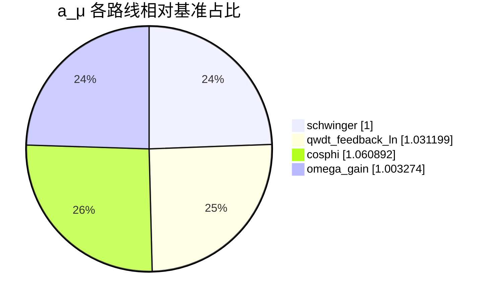

# μ子 g−2 多路线对比

| 路线 | a_μ | 备注 |
| --- | ---: | --- |
| schwinger | 0.0011615899231935474 |  |
| qwdt_feedback_ln | 0.001197830751396504 |  |
| cosphi | 0.0012323217673494977 |  |
| omega_gain | 0.0011653932141786289 |  |

