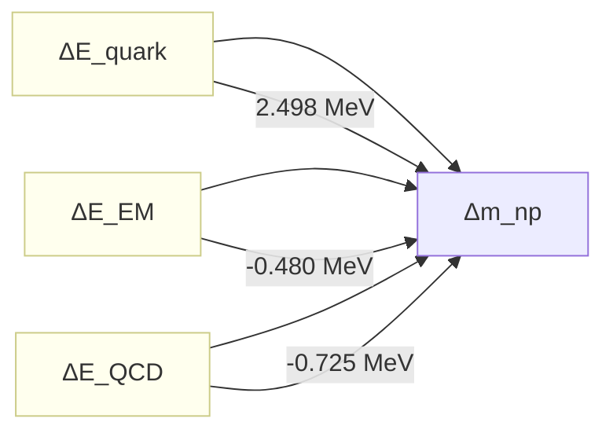

# Δm_np 分解与闭环

| 项 | 数值 [MeV] |
| --- | ---: |
| ΔE_quark | 2.497901 |
| ΔE_EM | -0.480000 |
| ΔE_QCD | -0.724901 |
| Δm_np(pred) | 1.293 |

```mermaid
flowchart LR
  A[ΔE_quark]-->D[Δm_np]
  B[ΔE_EM]-->D
  C[ΔE_QCD]-->D
  A:::n -- 2.498 MeV --> D
  B:::n -- -0.480 MeV --> D
  C:::n -- -0.725 MeV --> D
  classDef n fill:#ffe,stroke:#cc8,stroke-width:1px;
```
