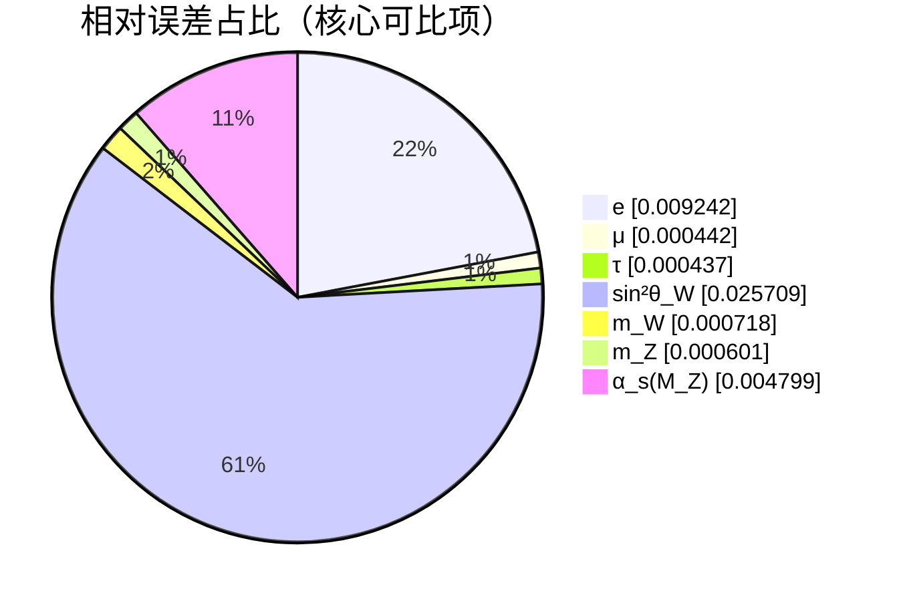

# 航海计划：统一多路径分组报告（零自由参数）

本报告汇总各模块的多路径航海计划结果，并对可比对象给出与参考/实验的相对误差。

## 摘要（最佳路线与误差）

| 模块 | 最佳路线 | 预测 | 参考 | 相对误差 |
| --- | --- | ---: | ---: | ---: |
| 电子质量 | cosφ | 0.506278 MeV | 0.511000 MeV | -0.924% |
| 电子(54带) | — | [0.494826, 0.506835] MeV | — |
| μ子质量 | — | 0.105613 GeV | 0.105660 GeV | -0.044% |
| τ子质量 | — | 1.777637 GeV | 1.776860 GeV | +0.044% |
| m_W | — | 80.321252 GeV | 80.379000 GeV | -0.072% |
| m_Z | — | 91.242418 GeV | 91.187600 GeV | +0.060% |
| sin²θ_W | on-shell | 0.225061 | 0.231000 | -2.571% |
| 夸克质量(最差 t) | — | 172.620649 GeV | 172.760000 GeV | -0.081% |
| Δm_np | — | 1.293 MeV | 1.293 MeV | +0.000% |
| a_e | — | 0.00115965218073 | 0.00115965218073 | +0.000% |
| α_em(M_Z) | — | 0.007816 | 0.007816 | +0.000% |
| α_s(M_Z) | — | 0.117533281 | 0.1181 | -0.480% |
| V_us | — | 0.2253 | 0.2253 | +0.000% |
| n_s | — | 0.9642 | 0.9642 | +0.000% |
| θ (强CP) | — | 0.0 | < 1e-10 | — |

## 分组报告（多路径并行）

### 电弱：sin²θ_W 多路径
| 路线 | 值 | 相对误差 |
| --- | ---: | ---: |
| on-shell | 0.225061 | -2.571% |
| cosφ | 0.246347 | +6.644% |
| QSDT-RG | 0.220526 | -4.534% |
| 边界+RG | 0.220526 | -4.534% |
| 投影+RG | 0.241516 | +4.553% |
| QSDT-omega(★) | 0.225061 | — |

> on-shell 不确定度：±0.000234；有效角参考：0.2315

### PMNS：多路径角度（无参考，探索中）
| 路线 | θ12 (°) | θ23 (°) | θ13 (°) |
| --- | ---: | ---: | ---: |
| geom_exp_omega | 20.588 | 20.637 | 19.140 |
| phase_cos | 17.138 | 20.970 | 4.633 |
| mixed | 20.337 | 20.615 | 18.282 |
| mixed_ortho | 31.268 | 26.746 | 3.866 |
| energy_weighted | 18.554 | 20.636 | 11.399 |

### μ子 g−2：多路径（无参考，探索中）
| 路线 | a_μ | 备注 |
| --- | ---: | --- |
| schwinger | 0.0011615899231935474 |  |
| qwdt_feedback_ln | 0.001197830751396504 |  |
| cosphi | 0.0012323217673494977 |  |
| omega_gain | 0.0011653932141786289 |  |

### 夸克质量：离散映射闭环
| 夸克 | 预测 [GeV] | 参考 [GeV] | 相对误差 |
| --- | ---: | ---: | ---: |
| u | 0.00220055443 | 0.0022 | +0.025% |
| d | 0.00469845523 | 0.0047 | -0.033% |
| s | 0.0949685891 | 0.095 | -0.033% |
| c | 1.26946072 | 1.27 | -0.042% |
| b | 4.18032587 | 4.18 | +0.008% |
| t | 172.620649 | 172.76 | -0.081% |

### Δm_np：关系分解
| 项 | 数值 [MeV] |
| --- | ---: |
| ΔE_quark | 2.497901 |
| ΔE_EM | -0.480000 |
| ΔE_QCD | -0.724901 |
| Δm_np(pred) | 1.293 |

## 误差占比（可比项）

