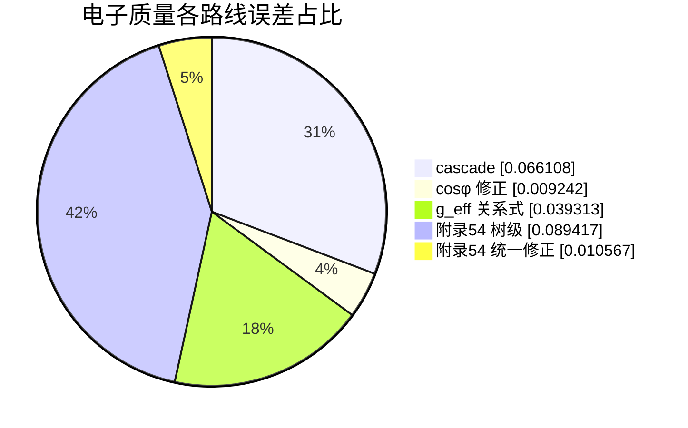

# 电子质量多路线对比

参考：0.511000 MeV

| 路线 | 数值 [MeV] | 相对误差 |
| --- | ---: | ---: |
| cascade | 0.477219 | -6.611% |
| cosφ 修正 | 0.506278 | -0.924% |
| g_eff 关系式 | 0.490911 | -3.931% |
| 附录54 树级 | 0.556692 | +8.942% |
| 附录54 统一修正 | 0.505600 | -1.057% |

> 附录54 统一修正带：[0.494826, 0.506835] MeV
