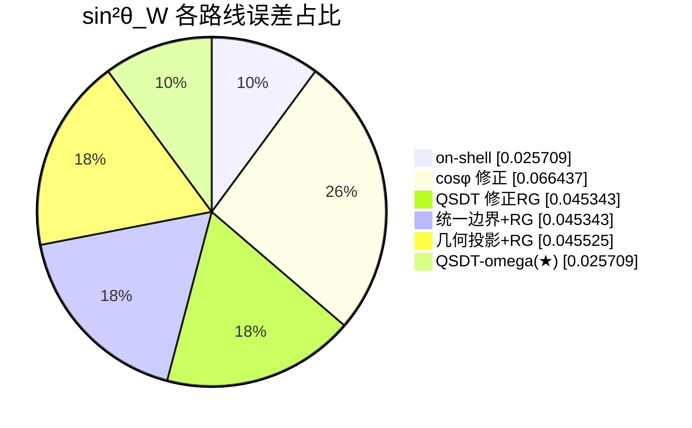
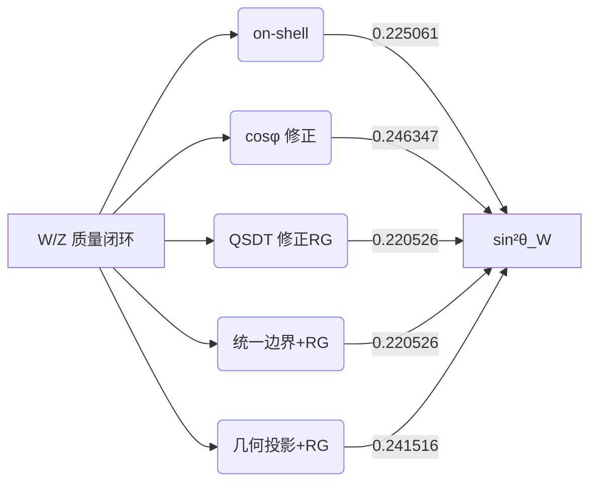

# 电弱 sin²θ_W 多路线对比

| 路线 | sin²θ_W | 相对误差 |
| --- | ---: | ---: |
| on-shell | 0.225061 | -2.571% |
| cosφ 修正 | 0.246347 | +6.644% |
| QSDT 修正RG | 0.220526 | -4.534% |
| 统一边界+RG | 0.220526 | -4.534% |
| 几何投影+RG | 0.241516 | +4.553% |
| QSDT-omega(★) | 0.225061 | -2.571% |

> on-shell 不确定度（附录55）：±0.000234，有效角参考：0.2315

