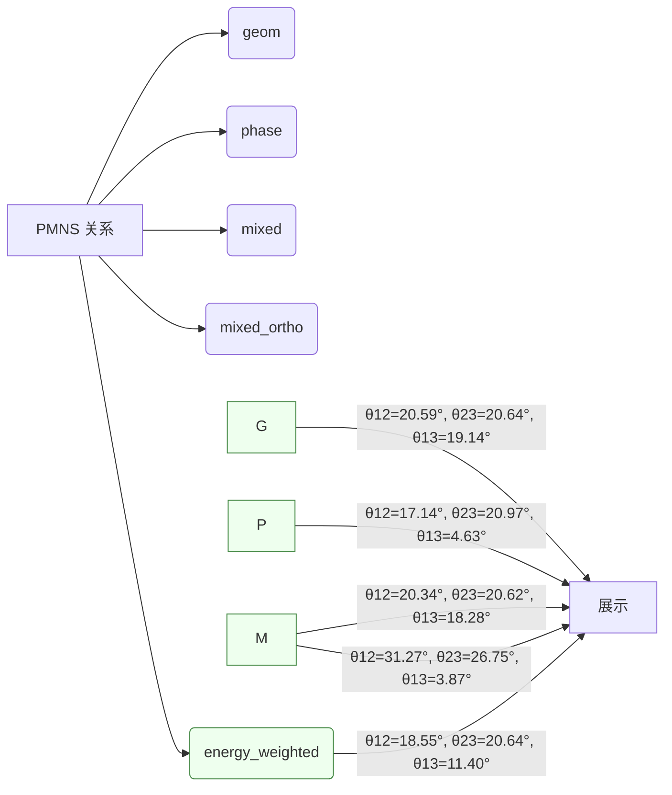

# PMNS 多路线对比

| 路线 | θ12 (°) | θ23 (°) | θ13 (°) |
| --- | ---: | ---: | ---: |
| geom_exp_omega | 20.588 | 20.637 | 19.140 |
| phase_cos | 17.138 | 20.970 | 4.633 |
| mixed | 20.337 | 20.615 | 18.282 |
| mixed_ortho | 31.268 | 26.746 | 3.866 |
| energy_weighted | 18.554 | 20.636 | 11.399 |

