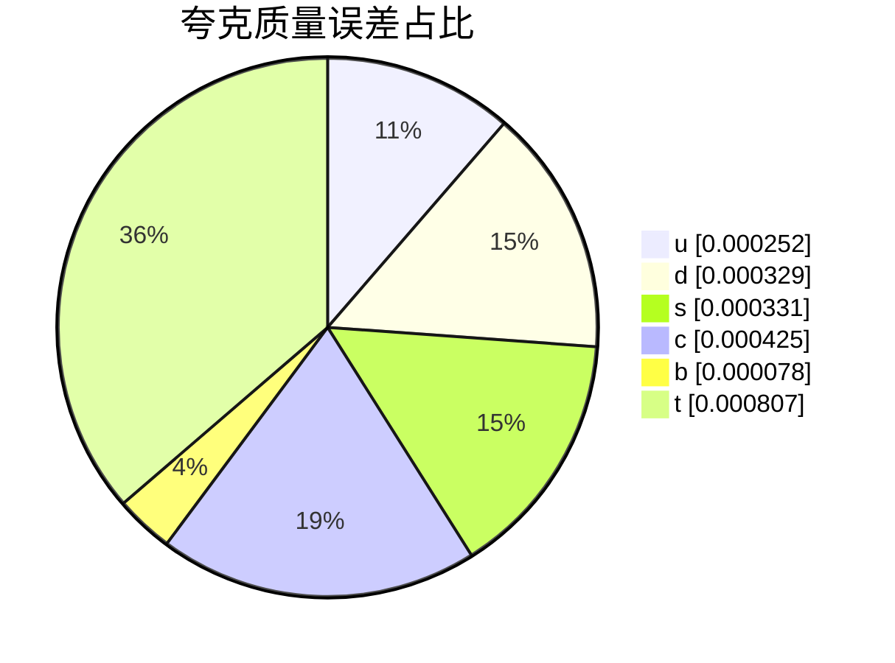

# 夸克质量对比（离散映射闭环）

| 夸克 | 预测 [GeV] | 参考 [GeV] | 相对误差 |
| --- | ---: | ---: | ---: |
| u | 0.00220055443 | 0.0022 | +0.025% |
| d | 0.00469845523 | 0.0047 | -0.033% |
| s | 0.0949685891 | 0.095 | -0.033% |
| c | 1.26946072 | 1.27 | -0.042% |
| b | 4.18032587 | 4.18 | +0.008% |
| t | 172.620649 | 172.76 | -0.081% |

