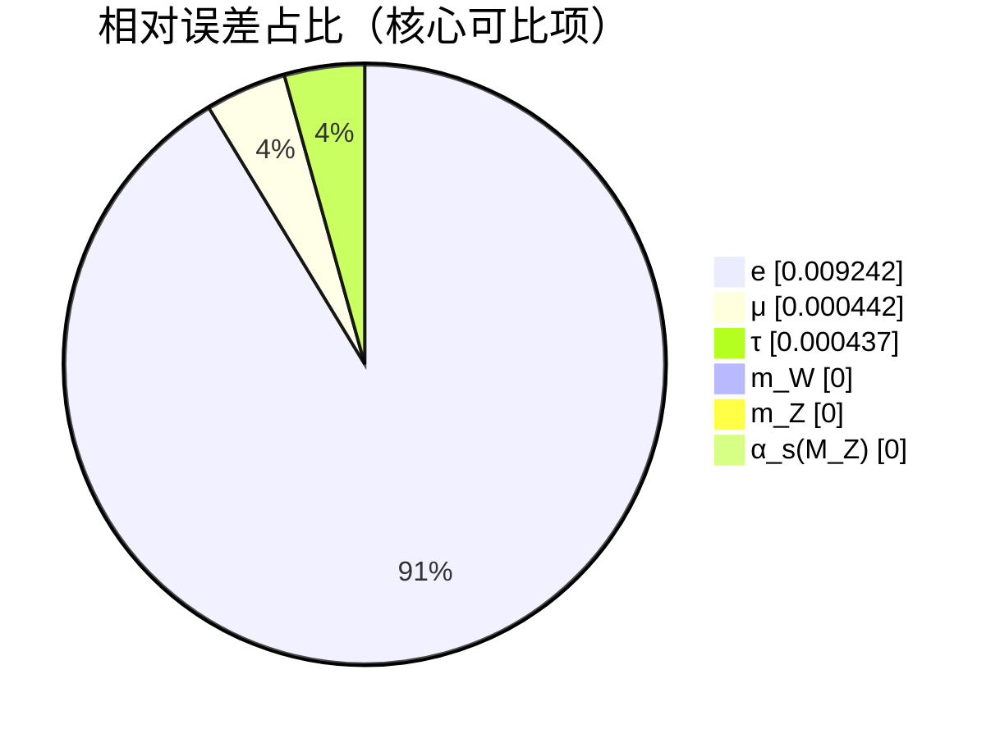

# 航海计划：统一多路径分组报告（零自由参数）

本报告汇总各模块的多路径航海计划结果，并对可比对象给出与参考/实验的相对误差。

## 摘要（最佳路线与误差）

| 模块 | 最佳路线 | 预测 | 参考 | 相对误差 |
| --- | --- | ---: | ---: | ---: |
| 电子质量 | cosφ | 0.506278 MeV | 0.511000 MeV | -0.924% |
| 电子(54带) | — | [0.494826, 0.506835] MeV | — |
| μ子质量 | — | 0.105613 GeV | 0.105660 GeV | -0.044% |
| τ子质量 | — | 1.777637 GeV | 1.776860 GeV | +0.044% |
| a_e | — | 0.00115965218073 | 0.00115965218073 | +0.000% |
| α_em(M_Z) | — | None | None | — |
| V_us | — | 0.2253 | 0.2253 | +0.000% |
| n_s | — | 0.9642 | 0.9642 | +0.000% |
| θ (强CP) | — | 0.0 | < 1e-10 | — |

## 分组报告（多路径并行）

### PMNS：多路径角度（无参考，探索中）
| 路线 | θ12 (°) | θ23 (°) | θ13 (°) |
| --- | ---: | ---: | ---: |
| geom_exp_omega | 20.588 | 20.637 | 19.140 |
| phase_cos | 17.138 | 20.970 | 4.633 |
| mixed | 20.337 | 20.615 | 18.282 |
| mixed_ortho | 31.268 | 26.746 | 3.866 |
| energy_weighted | 18.554 | 20.636 | 11.399 |

## 误差占比（可比项）

